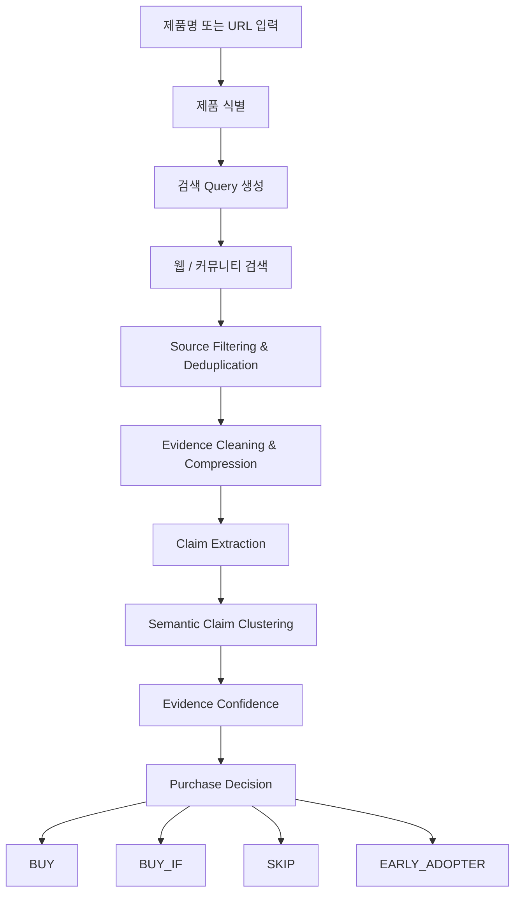

# ProofPick

> **리뷰를 믿기 어려울 때, 근거를 찾아 대신 검증해주는 AI 구매 리서치 서비스**

온라인에서 제품을 살 때 리뷰가 많아도 쉽게 믿기 어렵습니다.

체험단, 협찬, 짧은 사용 후기, 반복되는 홍보성 문구가 섞여 있고,  
결국 많은 사람들은 구매 전에 직접 검색합니다.

- `제품명 + 단점`
- `제품명 + 고장`
- `제품명 + 디시`
- `제품명 + 클리앙`
- `제품명 + Reddit`
- `제품명 + 6개월 사용`

**ProofPick은 이 과정을 자동화합니다.**

여러 공개 출처에서 실제 사용 경험을 찾고,  
중복되거나 복제된 근거를 걸러내고,  
반복해서 등장하는 장점과 문제를 묶고,  
근거가 충분한지 평가한 뒤 구매 판단을 돕습니다.

> **AI는 진실을 판정하지 않고, 근거를 찾아 정리합니다.**

---

## Why ProofPick?

기존 쇼핑 리뷰는 구매 결정에 유용하지만, 다음과 같은 한계가 있습니다.

- 협찬·체험단·광고성 리뷰가 섞여 있을 수 있음
- 구매 직후 작성된 짧은 후기만으로는 장기 사용 문제를 알기 어려움
- 같은 문제를 여러 사람이 겪었는지 직접 확인하기 어려움
- 커뮤니티, 블로그, Reddit 등 여러 사이트를 사용자가 직접 찾아봐야 함
- 신제품처럼 데이터가 적은 경우에도 억지로 평점이나 결론이 만들어질 수 있음

ProofPick은 **“리뷰가 많은가?”보다 “독립적인 근거가 반복되는가?”**를 더 중요하게 봅니다.

---

## What ProofPick Does

ProofPick은 하나의 제품을 다음 흐름으로 조사합니다.



단순히 여러 글을 요약하는 것이 아니라,  
**어떤 근거가 어디에서 왔고, 서로 독립적인지, 반복적으로 나타나는지**를 추적합니다.

---

## Purchase Decisions

ProofPick은 제품을 네 가지 상태로 표현합니다.

### `BUY`

현재 확보한 근거에서 구매를 막을 정도의 반복적이고 중대한 문제가 발견되지 않았고,  
구매를 지지할 만한 근거가 충분한 경우입니다.

### `BUY_IF`

전반적으로 구매 가능하지만 특정 조건이나 사용자 유형에 따라 주의가 필요한 경우입니다.

예:
- 소음에 민감하지 않다면 구매 가능
- 문턱이 높은 집이 아니라면 구매 가능
- 무선 안정성이 최우선이 아니라면 구매 가능

### `SKIP`

여러 독립적인 출처에서 구매를 재고할 정도의 중대한 문제가 반복적으로 확인된 경우입니다.

단 하나의 강한 불만만으로 `SKIP`을 결정하지 않습니다.

### `EARLY_ADOPTER`

아직 제품을 판단하기에 충분한 사용 경험이나 독립 근거가 없는 경우입니다.

신제품이나 데이터가 부족한 제품에 억지로 점수를 붙이지 않습니다.

> **모르면 모른다고 말하는 것도 구매 판단의 일부입니다.**

---

## Key Differentiators

### 1. 쇼핑몰 밖에서 찾습니다

판매 페이지의 리뷰만 보지 않고, 공개 웹과 커뮤니티의 실제 사용 경험까지 조사할 수 있는 구조를 지향합니다.

### 2. 출처를 숨기지 않습니다

AI의 요약만 보여주는 것이 아니라, 각 claim이 어떤 source에서 나온 것인지 추적할 수 있도록 provenance를 유지합니다.

### 3. 같은 글을 여러 명의 의견처럼 세지 않습니다

동일 URL, 복제 콘텐츠, 강한 중복 신호를 구분해 같은 내용이 여러 번 노출되었다는 이유만으로 독립적인 사용자 여러 명의 의견처럼 과대평가하지 않는 것을 목표로 합니다.

### 4. 장기 사용 경험을 중요하게 봅니다

언박싱이나 첫인상뿐 아니라 장기 배터리 성능, 내구성, 반복 고장 같은 장기 경험을 별도 신호로 다룰 수 있도록 설계합니다.

### 5. 근거의 양과 결론의 확실성을 구분합니다

ProofPick의 Evidence Confidence는 다음 요소를 분리해서 봅니다.

- Evidence Volume
- Source Independence
- Platform Diversity
- Agreement
- Long-term Evidence
- Commercial Signal

**Confidence는 제품 점수가 아니라, 현재 확보한 근거의 신뢰도입니다.**

### 6. 대안도 다시 검증합니다

문제가 많은 제품에 대해 대안을 단순 추천하는 데서 끝나지 않습니다.

향후 Alternative Flow에서는 추천된 대안 역시 동일한 ProofPick 분석 파이프라인을 다시 통과시켜 검증합니다.

> **대안도 검증합니다.**

---

## Reliability Principles

### Evidence over Verdict
AI가 “이 제품은 좋다 / 나쁘다”라고 임의로 선언하지 않습니다. 판단의 근거가 되는 source와 claim을 구조화합니다.

### Unknown is not Independent
출처가 다르다고 자동으로 독립적인 사용자 경험이라고 가정하지 않습니다.

### Unsupported Claims Must Not Drive Decisions
원문이 충분히 뒷받침하지 않는 claim은 구매 판단에 사용하지 않는 것을 원칙으로 합니다.

### Cheap by Default, Smart when Uncertain
deterministic code와 저비용 모델을 우선하고, 불확실할 때만 더 강한 모델을 사용합니다.

### Retrieve Once, Compress Once, Reuse Everywhere
웹 원문을 반복해서 LLM에 전달하지 않고 한 번 수집한 evidence를 정리·압축한 뒤 downstream에서 재사용합니다.

---

## Architecture

```text
User
 │
 ▼
Next.js Frontend
 │
 ▼
FastAPI Backend
 │
 ├─ Product Resolution
 ├─ Adaptive Query Generation
 ├─ Search Provider
 ├─ Source Filtering / Deduplication
 ├─ Evidence Processing
 ├─ Claim Extraction
 ├─ Claim Clustering
 ├─ Evidence Confidence
 └─ Purchase Decision
 │
 ▼
PostgreSQL / Supabase
```

### Planned Deployment

```text
Frontend   → Vercel
Backend    → Railway
Database   → Supabase PostgreSQL
Repository → GitHub
```

---

## Tech Stack

### Frontend
- Next.js
- TypeScript
- Tailwind CSS

### Backend
- Python
- FastAPI
- Pydantic
- httpx

### AI / Search
- OpenAI Responses API
- OpenAI Embeddings
- Tavily Search API

### Database / Infrastructure
- Supabase PostgreSQL
- Vercel
- Railway
- GitHub

---

## Current Pipeline Modules

```text
backend/app/
├── product_resolution/
├── query_generation/
├── search/
├── source_filtering/
├── evidence_processing/
├── claim_extraction/
├── claim_clustering/
├── confidence/
└── decision/
```

---

## Development Status

| Area | Status |
|---|---|
| Project Bootstrap | ✅ |
| Domain / Database Schema | ✅ |
| Search Provider | ✅ |
| Product Resolver | ✅ |
| Adaptive Query Generator | ✅ |
| Source Filtering / Deduplication | ✅ |
| Evidence Processing | ✅ |
| Claim Extraction | ✅ |
| Semantic Claim Clustering | ✅ |
| Evidence Confidence | ✅ |
| Purchase Decision | ✅ |
| Core Reliability Hardening | 🚧 |
| Counter-Evidence Search | ⏳ |
| Strong-model Confidence Gate | ⏳ |
| Alternative Engine | ⏳ |
| Alternative Re-verification | ⏳ |
| API Orchestration | ⏳ |
| Frontend Core Flow | ⏳ |
| Evaluation Harness | ⏳ |
| Deployment / Regression | ⏳ |

> 현재 상태는 해커톤 개발 중인 MVP이며, 정책 threshold와 confidence weight는 실데이터 평가를 통해 추가 보정될 예정입니다.

---

## Reliability Testing

ProofPick은 일반적인 unit test 외에도 **Red Team 방식의 adversarial validation**을 병행합니다.

예를 들어 다음과 같은 실패 사례를 의도적으로 검증합니다.

- 같은 글이 여러 사이트에 복제되어 독립 근거로 부풀려지는 경우
- 원문과 의미가 다른 claim이 grounding을 통과하는 경우
- 서로 다른 claim이 chaining으로 하나의 cluster가 되는 경우
- 데이터가 부족한데도 BUY가 나오는 경우
- 단일 심각 이슈가 사라지거나 반대로 과대평가되는 경우
- 신제품에 장기 사용 근거가 있는 것처럼 오인하는 경우

테스트 통과 자체보다 **잘못된 구매 판단이 만들어지는 경로를 찾는 것**을 중요하게 봅니다.

---

## Local Development

### 1. Repository

```powershell
git clone <repository-url>
cd proofpick
```

### 2. Backend

```powershell
cd backend
python -m venv .venv
.venv\Scripts\activate
pip install -r requirements.txt
uvicorn app.main:app --reload
```

기본 주소:

```text
http://127.0.0.1:8000
```

Health check:

```http
GET /health
```

```json
{
  "status": "ok"
}
```

### 3. Frontend

```powershell
cd frontend
npm install
npm run dev
```

기본 주소:

```text
http://localhost:3000
```

---

## Environment Variables

실제 secret은 repository에 commit하지 않습니다.

`.env.example`을 참고해 필요한 값을 설정합니다.

```env
TAVILY_API_KEY=
OPENAI_API_KEY=
OPENAI_CLAIM_MODEL=
OPENAI_EMBEDDING_MODEL=
```

---

## Testing

```powershell
$env:PYTHONPATH = 'backend'
backend\.venv\Scripts\python.exe -m pytest -p no:cacheprovider tests
```

기본 unit test는 외부 네트워크나 유료 API 호출 없이 실행되는 것을 원칙으로 합니다.

---

## Project Structure

```text
proofpick/
├── frontend/
├── backend/
│   └── app/
├── supabase/
│   └── migrations/
├── tests/
├── TASKS/
├── docs/
├── AGENTS.md
├── PROJECT_SPEC.md
├── .env.example
└── README.md
```

---

## What ProofPick Does Not Claim

ProofPick은 다음을 주장하지 않습니다.

- “이 리뷰는 가짜다”
- “이 제품은 절대 사면 안 된다”
- “AI가 제품의 진실을 판별했다”

대신 다음을 보여주는 것을 목표로 합니다.

- 어떤 문제가 반복적으로 언급되는가
- 몇 개의 독립적인 근거가 있는가
- 장기 사용 경험이 존재하는가
- 서로 충돌하는 경험은 무엇인가
- 현재 근거가 충분한가
- 그 근거를 바탕으로 어떤 구매 판단이 가능한가

---

## Project Philosophy

> **Evidence before confidence.  
> Confidence before decision.  
> Decision with provenance.**

ProofPick은 더 많은 리뷰를 보여주는 서비스가 아니라,  
**더 나은 근거를 바탕으로 구매 결정을 내릴 수 있게 돕는 서비스**를 목표로 합니다.

---

## Hackathon

ProofPick은 AI 기반 제품 리서치 및 구매 검증 경험을 구현하기 위한 해커톤 프로젝트입니다.

현재 MVP 개발 및 신뢰성 검증을 진행 중입니다.


# ProofPick

ProofPick is an evidence-grounded purchase verification service. It helps people make purchase decisions using evidence from multiple public sources rather than unsupported claims.

## Prerequisites

- Node.js and npm
- Python 3.12+

## Frontend

```powershell
Set-Location E:\proofpick\frontend
npm install
npm run dev
```

Open [http://localhost:3000](http://localhost:3000).

## Backend

```powershell
Set-Location E:\proofpick\backend
python -m venv .venv
.\.venv\Scripts\Activate.ps1
python -m pip install -r requirements.txt
uvicorn app.main:app --reload
```

The health endpoint is available at [http://127.0.0.1:8000/health](http://127.0.0.1:8000/health).

## Tests

```powershell
Set-Location E:\proofpick
$env:PYTHONPATH = "backend"
.\backend\.venv\Scripts\python.exe -m pytest tests
```

No external service configuration or credentials are required for this bootstrap task.
